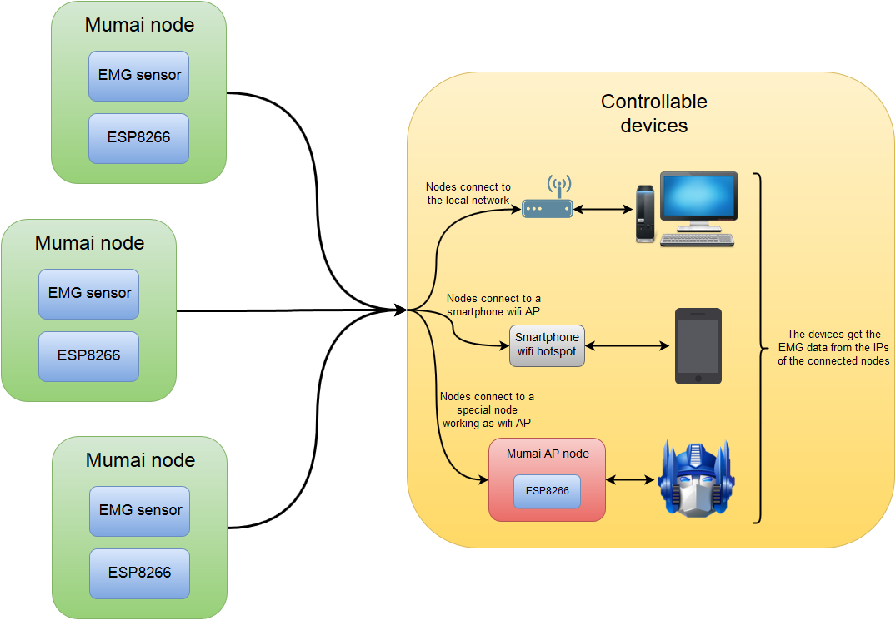

# Mumai
Mumai is a muscle-machine interface which uses EMG signals to control electronic or mechatronic devices.

# License
 This work is licensed under a <a rel="license" href="http://creativecommons.org/licenses/by-sa/4.0/">Creative Commons Attribution-ShareAlike 4.0 International License</a>.
